# Tarea 3 Configuración de VLANs y VTP

* Nombre: Johanna Alexandra Pérez Enriquez 
* carné 202200137
* Redes de Computadoras 1  
* Cesar Sazo
* Fecha: 28 de febrero 2026

# Introducción
El objetivo de esta práctica es implementar y analizar el protocolo **Spanning Tree Protocol (STP)** en una red con enlaces redundantes. Se demostrará cómo STP previene bucles de capa 2, cómo se elige el switch raíz, y se comparará el rendimiento entre **PVST** (por defecto) y **Rapid PVST**.

# Dispositivos utilizados
| Dispositivo | Modelo | Función |
|-------------|--------|---------|
| Switch0 | Cisco 2960-24TT | Switch Central (Root Bridge) |
| Switch1 | Cisco 2960-24TT | Switch de Acceso |
| Switch2 | Cisco 2960-24TT | Switch de Acceso |
| PC0, PC3 | PC-PT | VLAN 10 (Ventas) |
| PC2, PC4 | PC-PT | VLAN 20 (Compras) |

# conexiones y puertos
| Dispositivo | Puerto | Tipo | VLAN | Conectado a |
|-------------|--------|------|------|-------------|
| Switch1 | Fa0/1 | Access | 10 | PC0 |
| Switch1 | Fa0/2 | Access | 20 | PC2 |
| Switch1 | Fa0/3 | Trunk | - | Switch2 |
| Switch1 | Fa0/4 | Trunk | - | Switch0 |
| Switch0 | Fa0/1 | Trunk | - | Switch1 |
| Switch0 | Fa0/2 | Trunk | - | Switch2 |
| Switch2 | Fa0/1 | Access | 20 | PC4 |
| Switch2 | Fa0/2 | Access | 10 | PC3 |
| Switch2 | Fa0/3 | Trunk | - | Switch1 |
| Switch2 | Fa0/4 | Trunk | - | Switch0 |

# Configuración Vlans
Según el último dígito de mi carnet (**7**):

| Área | VLAN | Red | Subnet Mask |
|------|------|-----|-------------|
| Ventas | 10 | 192.168.17.0/24 | 255.255.255.0 |
| Compras | 20 | 192.168.27.0/24 | 255.255.255.0 |

## Asignación de IPs a las PCs

| PC | VLAN | IP Address | Subnet Mask |
|----|------|------------|-------------|
| PC0 | 10 (Ventas) | 192.168.17.2 | 255.255.255.0 |
| PC2 | 20 (Compras) | 192.168.27.2 | 255.255.255.0 |
| PC3 | 10 (Ventas) | 192.168.17.3 | 255.255.255.0 |
| PC4 | 20 (Compras) | 192.168.27.3 | 255.255.255.0 |

# Scripts de Configuración

## Configuración inicial
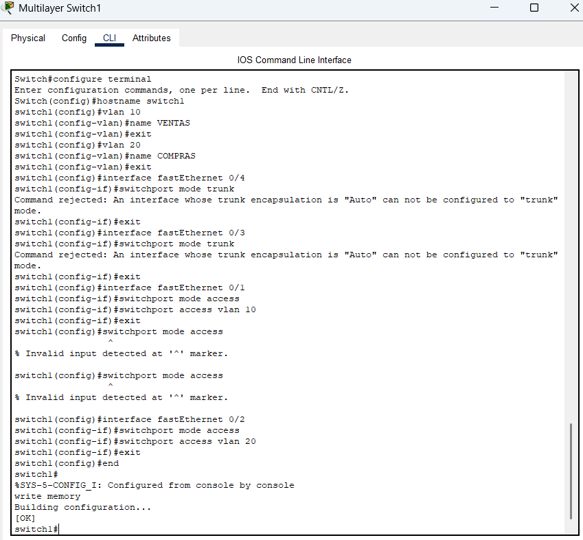
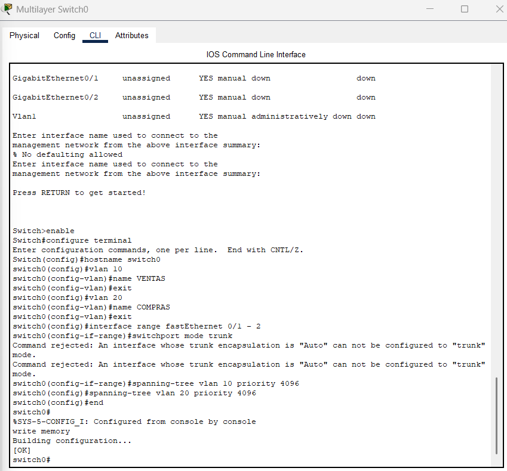
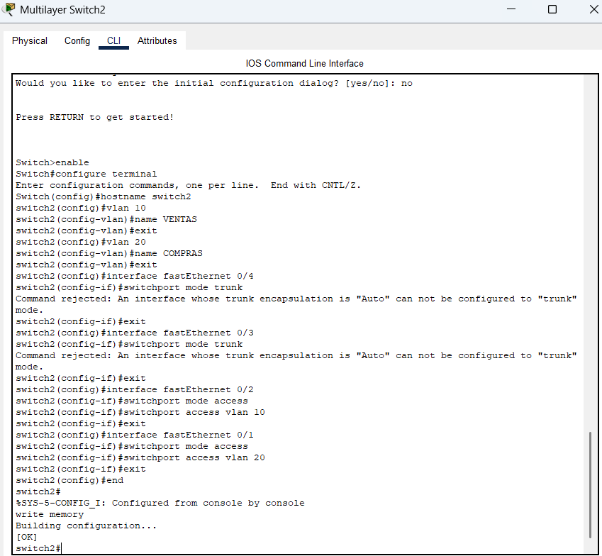

## Configuración STP
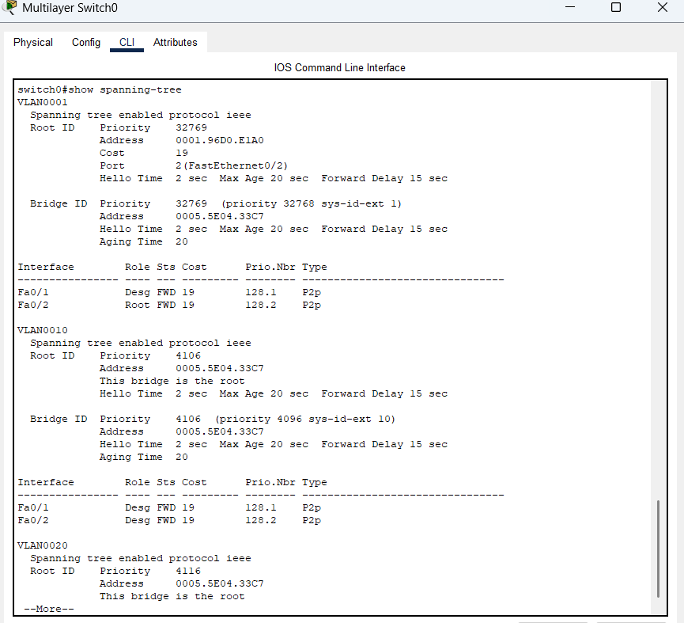
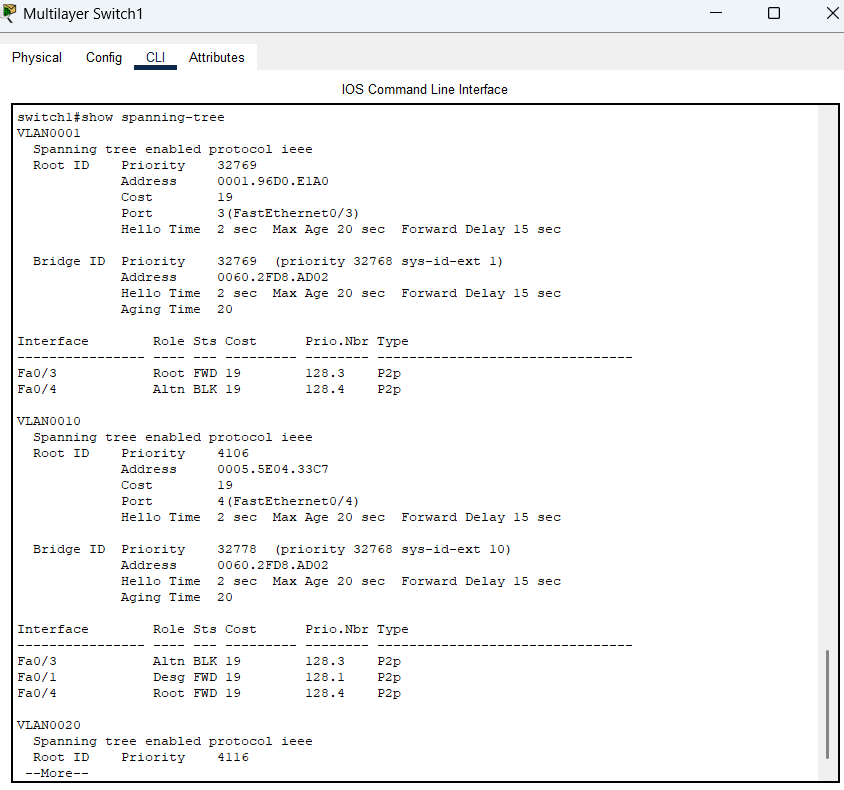
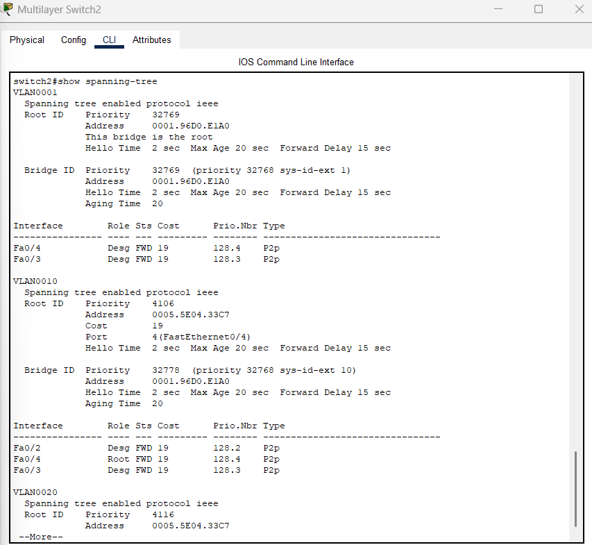

## Configuración de vlan
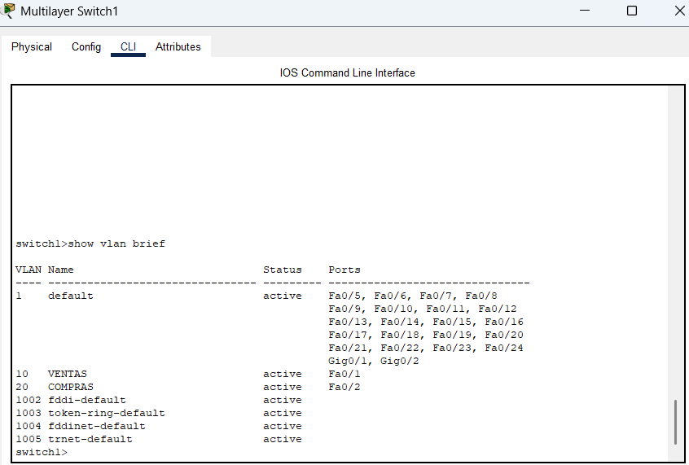
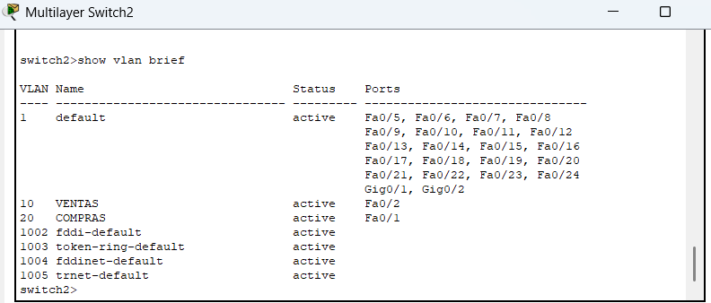
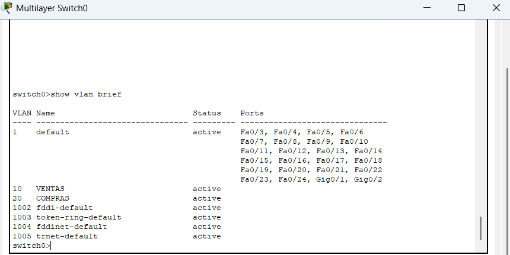

## Pings correctos y fallos
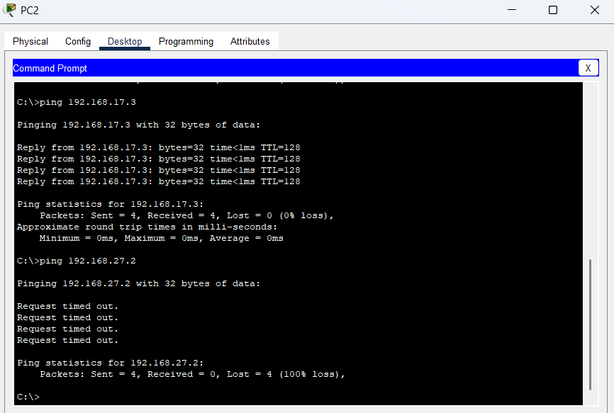
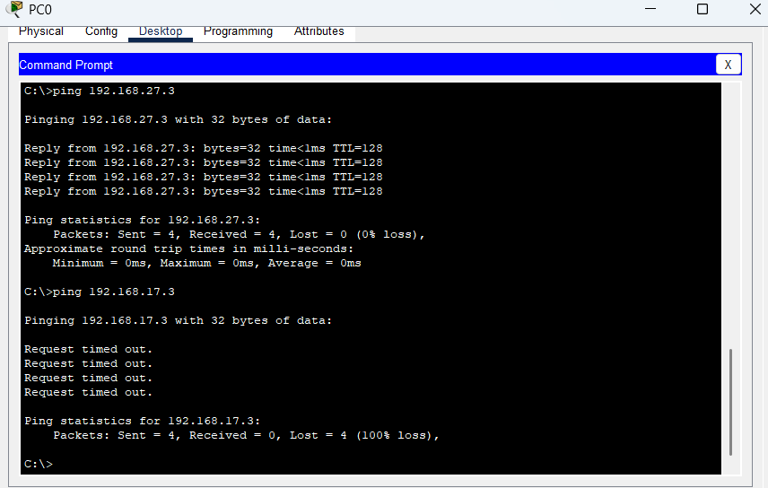

# Resultados
## PVST (Por Defecto)
Al realizar pings continuos entre PCs de la misma VLAN y eliminar un enlace trunk entre switches, se observó pérdida de aproximadamente 15-25 paquetes durante 30-50 segundos. Esto ocurre porque PVST tradicional requiere que los puertos pasen por cuatro estados antes de transmitir datos. Sí existe convergencia: después del tiempo de espera, los pings volvieron a responder correctamente cuando el puerto alternativo completó la transición a estado Forwarding.
## Rapid PVST
Al cambiar a Rapid PVST con el comando spanning-tree mode rapid-pvst en todos los switches y repetir la prueba, únicamente se perdieron 0-3 paquetes durante 1-2 segundos. Esta mejora significativa se debe al mecanismo Proposal/Agreement que permite transiciones rápidas sin depender de timers fijos, reduciendo los estados a tres.
