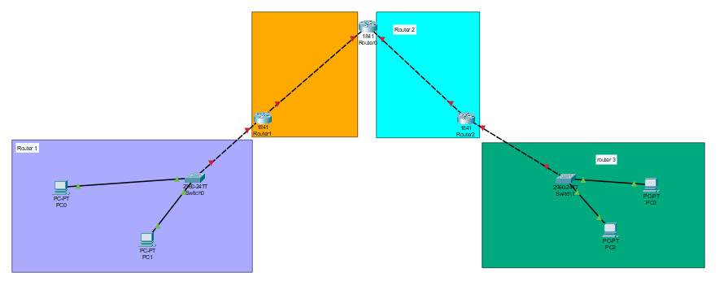
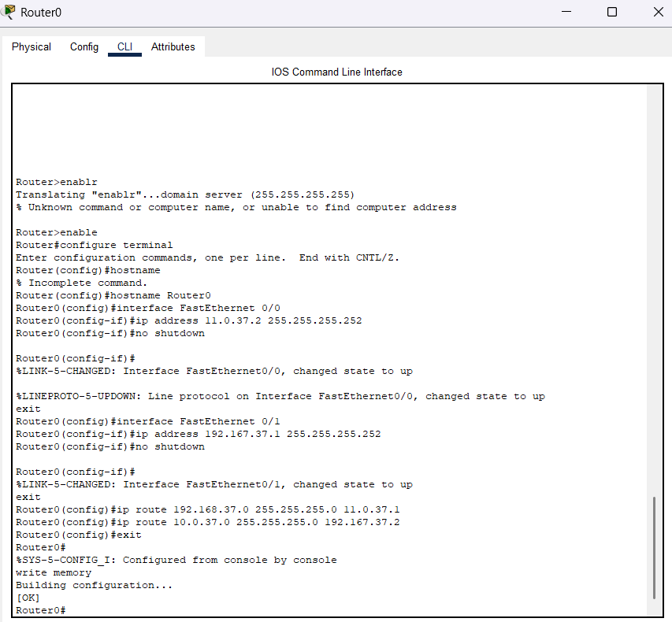
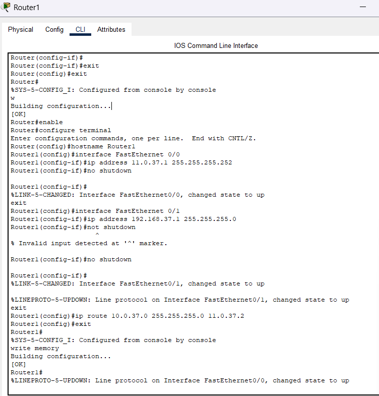
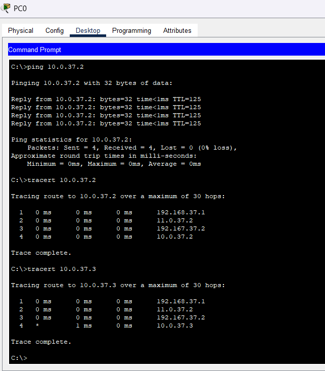
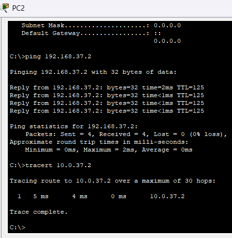

# Actividad Práctica 5: Enrutamiento Estático
**Universidad de San Carlos de Guatemala**  
**Facultad de Ingeniería**  
**Escuela de Ingeniería en Ciencias y Sistemas**

 **Curso:**  Redes de computadora 1
 **Actividad:** | Actividad Práctica 5: Enrutamiento Estático |
 **Carnet:** | 202200137 |
 **Nombre:** Johanna Alexandra Pérez Enriquez


## TOPOLOGÍA DE RED

### Descripción

La topología está conformada por:

- **Router 1:** Conectado a la red LAN `192.168.37.0/24` (PC0 y PC1)
- **Router 0:** Router intermedio que enlaza Router 1 y Router 2
- **Router 2:** Conectado a la red LAN `10.0.37.0/24` (PC2 y PC3)

**Enlaces punto a punto:**
- `11.0.37.0/30` entre Router 1 y Router 0
- `192.167.37.0/30` entre Router 0 y Router 2

> **Nota:** XX = 37 (últimos 2 dígitos del carnet 202200137)

### Diagrama de Topología



---

## 4. TABLA DE DIRECCIONAMIENTO IP

### 4.1 Routers

| Dispositivo | Interfaz | Dirección IP | Máscara de Subred | Función |
|------------|----------|-------------|-------------------|---------|
| **Router 1** | Fa0/0 | `11.0.37.1` | `255.255.255.252` | WAN → Router 0 |
| **Router 1** | Fa0/1 | `192.168.37.1` | `255.255.255.0` | LAN → Switch izquierdo |
| **Router 0** | Fa0/0 | `11.0.37.2` | `255.255.255.252` | WAN → Router 1 |
| **Router 0** | Fa0/1 | `192.167.37.1` | `255.255.255.252` | WAN → Router 2 |
| **Router 2** | Fa0/0 | `192.167.37.2` | `255.255.255.252` | WAN → Router 0 |
| **Router 2** | Fa0/1 | `10.0.37.1` | `255.255.255.0` | LAN → Switch derecho |

### 4.2 PCs

| Dispositivo | Dirección IP | Máscara de Subred | Default Gateway |
|------------|-------------|-------------------|-----------------|
| **PC0** | `192.168.37.2` | `255.255.255.0` | `192.168.37.1` |
| **PC1** | `192.168.37.3` | `255.255.255.0` | `192.168.37.1` |
| **PC2** | `10.0.37.2` | `255.255.255.0` | `10.0.37.1` |
| **PC3** | `10.0.37.3` | `255.255.255.0` | `10.0.37.1` |

---

## 5. CONFIGURACIÓN DE ROUTERS

### 5.1 Router 1 (Izquierdo)

```bash
enable
configure terminal
hostname Router1

! Configuración de interfaz hacia Router 0
interface FastEthernet0/0
 ip address 11.0.37.1 255.255.255.252
 no shutdown
exit

! Configuración de interfaz hacia LAN
interface FastEthernet0/1
 ip address 192.168.37.1 255.255.255.0
 no shutdown
exit

! Ruta estática hacia LAN derecha
ip route 10.0.37.0 255.255.255.0 11.0.37.2
exit
write memory
```
### comandos de verificación
show running-config
show ip route
show ip interface brief

## pruebas de conectividad
### comandos necesarios para el router



### pings de prueba y Traceroute



