# Manual Técnico — Proyecto 1: NetCore Academy

 * Nombre: Johanna Alexandra Pérez Enriquez
* Carné: 202200137
* curso: Redes de computadoras 1
* Catedrátrico: Cesar Sazo


---

## Índice
1. [Topología Completa](#1-topología-completa)
2. [Topología por Edificio](#2-topología-por-edificio)
3. [Jerarquía de Medios e Interfaces](#3-jerarquía-de-medios-e-interfaces)
4. [Tabla de VLANs](#4-tabla-de-vlans)
5. [Tabla de Dominios de Colisión](#5-tabla-de-dominios-de-colisión)
6. [Tabla de Dominios de Broadcast](#6-tabla-de-dominios-de-broadcast)
7. [Direccionamiento IP](#7-direccionamiento-ip)
8. [Comandos por Dispositivo](#8-comandos-por-dispositivo)
9. [Pruebas de Ping](#9-pruebas-de-ping)
10. [Evidencias Show Commands](#10-evidencias-show-commands)
11. [Presupuesto Estimado](#11-presupuesto-estimado)

---

## 1. Topología Completa

### Descripción General
El campus NetCore Academy está compuesto por 4 edificios interconectados mediante fibra óptica OM3 (100Base-FX) con EtherChannel PAgP. El switch SW-A1 (Edificio A) actúa como núcleo principal, VTP Server y Root Bridge en todas las VLANs. Se uso cables como fibra, Copper Straight Trought y Copper Cross-Over

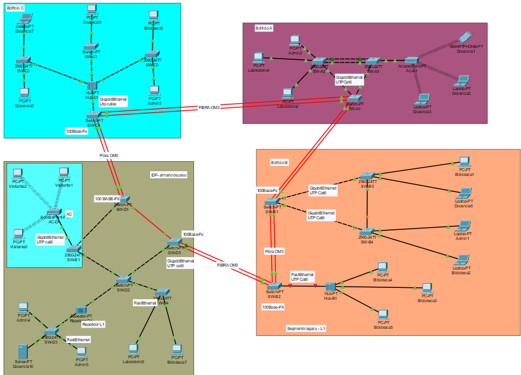

### Interconexiones entre edificios

| Enlace | Medio | Puertos | Protocolo |
|--------|-------|---------|-----------|
| SW-A1 <-> SW-B1 | Fibra OM3 (FFE x2) | Fa1/1-Fa2/1 <-> Fa1/1-Fa2/1 | EtherChannel PAgP (Po1) |
| SW-A1 <-> SW-C4 | Fibra OM3 (FFE x2) | Fa3/1-Fa4/1 <-> Fa1/1-Fa2/1 | EtherChannel PAgP (Po2) |
| SW-C4 <-> SW-D1 | Fibra OM3 (FFE x2) | Fa3/1-Fa4/1 <-> Fa1/1-Fa2/1 | EtherChannel PAgP |
| SW-D5 <-> SW-B2 | Fibra OM3 (FFE x2) | Fa1/1-Fa2/1 <-> Fa1/1-Fa2/1 | EtherChannel PAgP |
| SW-B1 <-> SW-B2 | Fibra OM3 (FFE x2) | Fa3/1-Fa4/1 <-> Fa3/1-Fa4/1 | EtherChannel PAgP |
| SW-D1 <-> SW-D5 | Fibra OM3 (FFE x1) | Fa3/1 <-> Fa3/1 | Trunk 802.1Q |

---

## 2. Topología por Edificio

### Edificio A
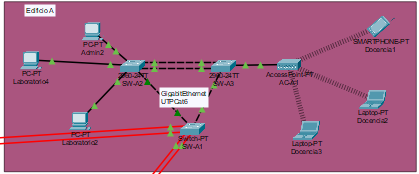

### Edificio B
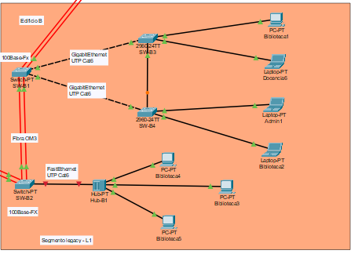

### Edificio C
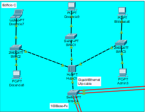

### Edificio D
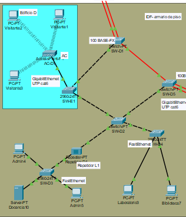

## 3. Jerarquía de Medios e Interfaces

| Nivel | Segmento | Medio | Interfaz | Dispositivos |
|-------|----------|-------|----------|--------------|
| Interconexión edificios | Entre switches de agregación | Fibra optica OM3 (100Base-FX) | FastEthernet (modulo FFE) | SW-A1<->SW-B1, SW-A1<->SW-C4, SW-C4<->SW-D1, SW-D5<->SW-B2, SW-B1<->SW-B2 |
| Distribución interna | Switch agregación -> Switch acceso | Cobre UTP Cat6 | GigabitEthernet | SW-A1->SW-A2, SW-A1->SW-A3, SW-B1->SW-B3, SW-B1->SW-B4 |
| Acceso usuarios | Switch acceso -> Dispositivos finales | Cobre UTP Cat5e | FastEthernet | SW-A2->PCs, SW-B3->PCs, SW-C2->Laptops |
| Segmento Legacy L1 | SW-B2 -> Hub-B1 -> PCs | Cobre UTP Cat5e | FastEthernet | Hub-B1 con Bib3, Bib4, Bib5 |
| Nucleo L1 Edificio C | SW-C4 -> Hub-C1 -> Switches | Cobre UTP Cat6 | FastEthernet | Hub-C1 con SW-C1, SW-C2, SW-C3 |
| Extension física L1 | SW-D2 -> Repeater -> SW-D3 | Cobre UTP Cat5e | FastEthernet | Repetidor-D1 entre SW-D2 y SW-D3 |
| Acceso inalambrico | AP -> Laptops/Smartphones | WiFi 802.11 | Inalambrico | AC-A1->Doc1,Doc2,Doc3 / AC-D1->Vis3 |

---

## 4. Tabla de VLANs

> X = 7 (ultimo digito del carnet 202200137)

| VLAN ID | Nombre | Area | Dirección de Red |
|---------|--------|------|-----------------|
| 17 | ADMIN | Administración | 192.168.17.0/24 |
| 27 | DOCENTES | Docencia | 192.168.27.0/24 |
| 37 | BIBLIOTECA | Biblioteca | 192.168.37.0/24 |
| 47 | LABORATORIO | Laboratorio de Redes | 192.168.47.0/24 |
| 57 | VISITANTE | Visitantes | 192.168.57.0/24 |

---

## 5. Tabla de Dominios de Colisión

> Un dominio de colisión es el segmento donde dos dispositivos pueden causar colisión al transmitir simultáneamente. Cada puerto de switch = 1 dominio individual. Los hubs y repetidores comparten 1 solo dominio entre todos sus puertos.

### Edificio A

| Dominio | Dispositivos | Tipo |
|---------|-------------|------|
| 1 por puerto SW-A2 | Admin2, Laboratorio4, Laboratorio2 | Individual (switch) |
| 1 por puerto SW-A3 | AC-A1 | Individual (switch) |
| **Total Edificio A** | **4 dominios individuales** | |

### Edificio B

| Dominio | Dispositivos | Tipo |
|---------|-------------|------|
| 1 por puerto SW-B3 | Biblioteca1, Docencia6 | Individual (switch) |
| 1 por puerto SW-B4 | Admin1, Biblioteca2 | Individual (switch) |
| **1 dominio compartido Hub-B1** | **Biblioteca3, Biblioteca4, Biblioteca5** | **Compartido (hub L1)** |
| **Total Edificio B** | **4 individuales + 1 compartido** | |

### Edificio C

| Dominio | Dispositivos | Tipo |
|---------|-------------|------|
| **1 dominio compartido Hub-C1** | **SW-C1, SW-C2, SW-C3** | **Compartido (hub L1)** |
| 1 por puerto SW-C1 | Docencia9 | Individual (switch) |
| 1 por puerto SW-C2 | Docencia7, Docencia8 | Individual (switch) |
| 1 por puerto SW-C3 | Biblioteca6, Admin3 | Individual (switch) |
| **Total Edificio C** | **5 individuales + 1 compartido** | |

### Edificio D

| Dominio | Dispositivos | Tipo |
|---------|-------------|------|
| **1 dominio extendido Repeater-D1** | **SW-D2 <-> SW-D3** | **Compartido (repetidor L1)** |
| 1 por puerto SW-D3 | Admin4, Admin5, Docencia10 | Individual (switch) |
| 1 por puerto SW-D4 | Laboratorio3, Biblioteca7 | Individual (switch) |
| 1 por puerto SW-E1 | Visitantes1, Visitantes2, AC-D1 | Individual (switch) |
| **Total Edificio D** | **6 individuales + 1 extendido** | |

---

## 6. Tabla de Dominios de Broadcast


### VLAN 17 — ADMIN (192.168.17.0/24)

| Dispositivo | Edificio | IP |
|-------------|----------|----|
| Admin2 | A | 192.168.17.2 |
| Admin1 | B | 192.168.17.3 |
| Admin3 | C | 192.168.17.4 |
| Admin4 | D | 192.168.17.5 |
| Admin5 | D | 192.168.17.6 |

### VLAN 27 — DOCENTES (192.168.27.0/24)

| Dispositivo | Edificio | IP |
|-------------|----------|----|
| Docencia1 (Smartphone WiFi) | A | 192.168.27.2 |
| Docencia2 (Laptop WiFi) | A | 192.168.27.3 |
| Docencia3 (Laptop WiFi) | A | 192.168.27.4 |
| Docencia6 | B | 192.168.27.5 |
| Docencia7 | C | 192.168.27.6 |
| Docencia8 | C | 192.168.27.7 |
| Docencia9 | C | 192.168.27.8 |
| Docencia10 (Server) | D | 192.168.27.9 |

### VLAN 37 — BIBLIOTECA (192.168.37.0/24)

| Dispositivo | Edificio | IP |
|-------------|----------|----|
| Biblioteca1 | B | 192.168.37.2 |
| Biblioteca2 | B | 192.168.37.3 |
| Biblioteca3 (Hub) | B | 192.168.37.4 |
| Biblioteca4 (Hub) | B | 192.168.37.5 |
| Biblioteca5 (Hub) | B | 192.168.37.6 |
| Biblioteca6 | C | 192.168.37.7 |
| Biblioteca7 | D | 192.168.37.8 |

### VLAN 47 — LABORATORIO (192.168.47.0/24)

| Dispositivo | Edificio | IP |
|-------------|----------|----|
| Laboratorio4 | A | 192.168.47.2 |
| Laboratorio2 | A | 192.168.47.3 |
| Laboratorio3 | D | 192.168.47.4 |

### VLAN 57 — VISITANTE (192.168.57.0/24)

| Dispositivo | Edificio | IP |
|-------------|----------|----|
| Visitantes1 | D | 192.168.57.2 |
| Visitantes2 | D | 192.168.57.3 |
| Visitantes3 (Laptop WiFi) | D | 192.168.57.4 |

---

## 7. Direccionamiento IP

| Dispositivo | VLAN | IP | Mascara | Gateway |
|-------------|------|----|---------|---------|
| Admin2 | 17 | 192.168.17.2 | 255.255.255.0 | 192.168.17.1 |
| Admin1 | 17 | 192.168.17.3 | 255.255.255.0 | 192.168.17.1 |
| Admin3 | 17 | 192.168.17.4 | 255.255.255.0 | 192.168.17.1 |
| Admin4 | 17 | 192.168.17.5 | 255.255.255.0 | 192.168.17.1 |
| Admin5 | 17 | 192.168.17.6 | 255.255.255.0 | 192.168.17.1 |
| Docencia1 (Smartphone) | 27 | 192.168.27.2 | 255.255.255.0 | 192.168.27.1 |
| Docencia2 (Laptop) | 27 | 192.168.27.3 | 255.255.255.0 | 192.168.27.1 |
| Docencia3 (Laptop) | 27 | 192.168.27.4 | 255.255.255.0 | 192.168.27.1 |
| Docencia6 | 27 | 192.168.27.5 | 255.255.255.0 | 192.168.27.1 |
| Docencia7 | 27 | 192.168.27.6 | 255.255.255.0 | 192.168.27.1 |
| Docencia8 | 27 | 192.168.27.7 | 255.255.255.0 | 192.168.27.1 |
| Docencia9 | 27 | 192.168.27.8 | 255.255.255.0 | 192.168.27.1 |
| Docencia10 (Server) | 27 | 192.168.27.9 | 255.255.255.0 | 192.168.27.1 |
| Biblioteca1 | 37 | 192.168.37.2 | 255.255.255.0 | 192.168.37.1 |
| Biblioteca2 | 37 | 192.168.37.3 | 255.255.255.0 | 192.168.37.1 |
| Biblioteca3 | 37 | 192.168.37.4 | 255.255.255.0 | 192.168.37.1 |
| Biblioteca4 | 37 | 192.168.37.5 | 255.255.255.0 | 192.168.37.1 |
| Biblioteca5 | 37 | 192.168.37.6 | 255.255.255.0 | 192.168.37.1 |
| Biblioteca6 | 37 | 192.168.37.7 | 255.255.255.0 | 192.168.37.1 |
| Biblioteca7 | 37 | 192.168.37.8 | 255.255.255.0 | 192.168.37.1 |
| Laboratorio4 | 47 | 192.168.47.2 | 255.255.255.0 | 192.168.47.1 |
| Laboratorio2 | 47 | 192.168.47.3 | 255.255.255.0 | 192.168.47.1 |
| Laboratorio3 | 47 | 192.168.47.4 | 255.255.255.0 | 192.168.47.1 |
| Visitantes1 | 57 | 192.168.57.2 | 255.255.255.0 | 192.168.57.1 |
| Visitantes2 | 57 | 192.168.57.3 | 255.255.255.0 | 192.168.57.1 |
| Visitantes3 (Laptop) | 57 | 192.168.57.4 | 255.255.255.0 | 192.168.57.1 |

---

## 8. Comandos por Dispositivo

### SW-A1 — VTP Server / Root Bridge

```
enable
configure terminal
hostname SW-A1
banner motd # Bienvenido a Edificio A - NETCORE_202200137 #
enable secret cisco123
line console 0
 password cisco123
 login
exit
line vty 0 4
 password cisco123
 login
exit
vlan 17
 name ADMIN
exit
vlan 27
 name DOCENTES
exit
vlan 37
 name BIBLIOTECA
exit
vlan 47
 name LABORATORIO
exit
vlan 57
 name VISITANTE
exit
vtp mode server
vtp domain C3_NetCore
vtp version 2
spanning-tree mode rapid-pvst
spanning-tree vlan 17 priority 4096
spanning-tree vlan 27 priority 4096
spanning-tree vlan 37 priority 4096
spanning-tree vlan 47 priority 4096
spanning-tree vlan 57 priority 4096
interface FastEthernet1/1
 channel-group 1 mode desirable
 no shutdown
exit
interface FastEthernet2/1
 channel-group 1 mode desirable
 no shutdown
exit
interface FastEthernet3/1
 channel-group 2 mode desirable
 no shutdown
exit
interface FastEthernet4/1
 channel-group 2 mode desirable
 no shutdown
exit
interface Port-channel1
 switchport mode trunk
 switchport trunk allowed vlan 17,27,37,47,57
exit
interface Port-channel2
 switchport mode trunk
 switchport trunk allowed vlan 17,27,37,47,57
exit
interface GigabitEthernet5/1
 switchport mode trunk
 switchport trunk allowed vlan 17,27,37,47,57
 no shutdown
exit
interface GigabitEthernet6/1
 switchport mode trunk
 switchport trunk allowed vlan 17,27,37,47,57
 no shutdown
exit
vtp password proyecto12026
end
write memory
```

### SW-A2 — VTP Cliente / Acceso Edificio A

```
enable
configure terminal
hostname SW-A2
enable secret cisco123
line console 0
 password cisco123
 login
exit
vtp mode client
vtp domain C3_NetCore
vtp version 2
spanning-tree mode rapid-pvst
interface GigabitEthernet0/1
 switchport mode trunk
 switchport trunk allowed vlan 17,27,37,47,57
 no shutdown
exit
interface GigabitEthernet0/2
 channel-group 1 mode active
 no shutdown
exit
interface FastEthernet0/4
 channel-group 1 mode active
 no shutdown
exit
interface Port-channel1
 switchport mode trunk
 switchport trunk allowed vlan 17,27,37,47,57
exit
interface FastEthernet0/1
 switchport mode access
 switchport access vlan 17
 no shutdown
exit
interface FastEthernet0/2
 switchport mode access
 switchport access vlan 47
 no shutdown
exit
interface FastEthernet0/3
 switchport mode access
 switchport access vlan 47
 no shutdown
exit
vtp password proyecto12026
end
write memory
```

### SW-A3 — VTP Cliente / Acceso + AP Edificio A

```
enable
configure terminal
hostname SW-A3
banner motd # Bienvenido a Edificio A - NETCORE_202200137 #
enable secret cisco123
line console 0
 password cisco123
 login
exit
vtp mode client
vtp domain C3_NetCore
vtp version 2
spanning-tree mode rapid-pvst
interface GigabitEthernet0/1
 switchport mode trunk
 switchport trunk allowed vlan 17,27,37,47,57
 no shutdown
exit
interface GigabitEthernet0/2
 channel-group 1 mode active
 no shutdown
exit
interface FastEthernet0/4
 channel-group 1 mode active
 no shutdown
exit
interface Port-channel1
 switchport mode trunk
 switchport trunk allowed vlan 17,27,37,47,57
exit
interface FastEthernet0/1
 switchport mode access
 switchport access vlan 27
 no shutdown
exit
vtp password proyecto12026
end
write memory
```

### SW-B1 — VTP Cliente / Agregación Edificio B

```
enable
configure terminal
hostname SW-B1
banner motd # Bienvenido a Edificio B - NETCORE_202200137 #
enable secret cisco123
line console 0
 password cisco123
 login
exit
vtp mode client
vtp domain C3_NetCore
vtp version 2
spanning-tree mode rapid-pvst
interface FastEthernet1/1
 channel-group 1 mode desirable
 no shutdown
exit
interface FastEthernet2/1
 channel-group 1 mode desirable
 no shutdown
exit
interface FastEthernet3/1
 channel-group 2 mode desirable
 no shutdown
exit
interface FastEthernet4/1
 channel-group 2 mode desirable
 no shutdown
exit
interface Port-channel1
 switchport mode trunk
 switchport trunk allowed vlan 17,27,37,47,57
exit
interface Port-channel2
 switchport mode trunk
 switchport trunk allowed vlan 17,27,37,47,57
exit
interface GigabitEthernet5/1
 switchport mode trunk
 switchport trunk allowed vlan 17,27,37,47,57
 no shutdown
exit
interface GigabitEthernet6/1
 switchport mode trunk
 switchport trunk allowed vlan 17,27,37,47,57
 no shutdown
exit
vtp password proyecto12026
end
write memory
```

### SW-B2 — VTP Cliente / Agregación + Hub Legacy

```
enable
configure terminal
hostname SW-B2
enable secret cisco123
line console 0
 password cisco123
 login
exit
vtp mode client
vtp domain C3_NetCore
vtp version 2
spanning-tree mode rapid-pvst
interface FastEthernet1/1
 channel-group 1 mode desirable
 no shutdown
exit
interface FastEthernet2/1
 channel-group 1 mode desirable
 no shutdown
exit
interface FastEthernet3/1
 channel-group 2 mode desirable
 no shutdown
exit
interface FastEthernet4/1
 channel-group 2 mode desirable
 no shutdown
exit
interface Port-channel1
 switchport mode trunk
 switchport trunk allowed vlan 17,27,37,47,57
exit
interface Port-channel2
 switchport mode trunk
 switchport trunk allowed vlan 17,27,37,47,57
exit
interface FastEthernet7/1
 switchport mode access
 switchport access vlan 37
 description Hub-B1_Legacy_L1
 no shutdown
exit
vtp password proyecto12026
end
write memory
```

### SW-B3 — VTP Cliente / Acceso Biblioteca y Docencia

```
enable
configure terminal
hostname SW-B3
enable secret cisco123
line console 0
 password cisco123
 login
exit
vtp mode client
vtp domain C3_NetCore
vtp version 2
spanning-tree mode rapid-pvst
interface GigabitEthernet0/1
 switchport mode trunk
 switchport trunk allowed vlan 17,27,37,47,57
 no shutdown
exit
interface FastEthernet0/3
 switchport mode trunk
 switchport trunk allowed vlan 17,27,37,47,57
 no shutdown
exit
interface FastEthernet0/1
 switchport mode access
 switchport access vlan 37
 no shutdown
exit
interface FastEthernet0/2
 switchport mode access
 switchport access vlan 27
 no shutdown
exit
vtp password proyecto12026
end
write memory
```

### SW-B4 — VTP Cliente / Acceso Admin y Biblioteca (2960-24TT)

```
enable
configure terminal
hostname SW-B4
banner motd # Bienvenido a Edificio B - NETCORE_202200137 #
enable secret cisco123
line console 0
 password cisco123
 login
exit
vtp mode client
vtp domain C3_NetCore
vtp version 2
spanning-tree mode rapid-pvst
interface GigabitEthernet0/1
 switchport mode trunk
 switchport trunk allowed vlan 17,27,37,47,57
 no shutdown
exit
interface FastEthernet0/3
 switchport mode trunk
 switchport trunk allowed vlan 17,27,37,47,57
 no shutdown
exit
interface FastEthernet0/1
 switchport mode access
 switchport access vlan 17
 description Admin1
 no shutdown
exit
interface FastEthernet0/2
 switchport mode access
 switchport access vlan 37
 description Biblioteca2
 no shutdown
exit
vtp password proyecto12026
end
write memory
```

### SW-C4 — VTP Cliente / Punto entrada Edificio C

```
enable
configure terminal
hostname SW-C4
banner motd # Bienvenido a Edificio C - NETCORE_202200137 #
enable secret cisco123
line console 0
 password cisco123
 login
exit
vtp mode client
vtp domain C3_NetCore
vtp version 2
spanning-tree mode rapid-pvst
interface FastEthernet1/1
 channel-group 1 mode desirable
 no shutdown
exit
interface FastEthernet2/1
 channel-group 1 mode desirable
 no shutdown
exit
interface FastEthernet3/1
 channel-group 2 mode desirable
 no shutdown
exit
interface FastEthernet4/1
 channel-group 2 mode desirable
 no shutdown
exit
interface Port-channel1
 switchport mode trunk
 switchport trunk allowed vlan 17,27,37,47,57
exit
interface Port-channel2
 switchport mode trunk
 switchport trunk allowed vlan 17,27,37,47,57
exit
interface GigabitEthernet5/1
 switchport mode trunk
 switchport trunk allowed vlan 17,27,37,47,57
 no shutdown
exit
vtp password proyecto12026
end
write memory
```

### SW-C1 — VTP Cliente / Acceso Edificio C (Switch-PT)

```
enable
configure terminal
hostname SW-C1
enable secret cisco123
line console 0
 password cisco123
 login
exit
vtp mode client
vtp domain C3_NetCore
vtp version 2
spanning-tree mode rapid-pvst
interface FastEthernet0/1
 switchport mode trunk
 switchport trunk allowed vlan 17,27,37,47,57
 no shutdown
exit
interface FastEthernet1/1
 switchport mode access
 switchport access vlan 27
 description Docencia9
 no shutdown
exit
vtp password proyecto12026
end
write memory
```

### SW-C2 — VTP Cliente / Acceso Edificio C

```
enable
configure terminal
hostname SW-C2
enable secret cisco123
line console 0
 password cisco123
 login
exit
vtp mode client
vtp domain C3_NetCore
vtp version 2
spanning-tree mode rapid-pvst
interface FastEthernet0/1
 switchport mode trunk
 switchport trunk allowed vlan 17,27,37,47,57
 no shutdown
exit
interface FastEthernet0/2
 switchport mode access
 switchport access vlan 27
 description Docencia7
 no shutdown
exit
interface FastEthernet0/3
 switchport mode access
 switchport access vlan 27
 description Docencia8
 no shutdown
exit
vtp password proyecto12026
end
write memory
```

### SW-C3 — VTP Cliente / Acceso Edificio C

```
enable
configure terminal
hostname SW-C3
banner motd # Bienvenido a Edificio C - NETCORE_202200137 #
enable secret cisco123
line console 0
 password cisco123
 login
exit
vtp mode client
vtp domain C3_NetCore
vtp version 2
spanning-tree mode rapid-pvst
interface FastEthernet0/1
 switchport mode trunk
 switchport trunk allowed vlan 17,27,37,47,57
 no shutdown
exit
interface FastEthernet0/2
 switchport mode access
 switchport access vlan 37
 description Biblioteca6
 no shutdown
exit
interface FastEthernet0/3
 switchport mode access
 switchport access vlan 17
 description Admin3
 no shutdown
exit
vtp password proyecto12026
end
write memory
```

### SW-D1 — VTP Cliente / IDF Armario de Piso

```
enable
configure terminal
hostname SW-D1
banner motd # Bienvenido a Edificio D - NETCORE_202200137 #
enable secret cisco123
line console 0
 password cisco123
 login
exit
vtp mode client
vtp domain C3_NetCore
vtp version 2
spanning-tree mode rapid-pvst
interface FastEthernet1/1
 channel-group 1 mode desirable
 no shutdown
exit
interface FastEthernet2/1
 channel-group 1 mode desirable
 no shutdown
exit
interface Port-channel1
 switchport mode trunk
 switchport trunk allowed vlan 17,27,37,47,57
exit
interface FastEthernet3/1
 switchport mode trunk
 switchport trunk allowed vlan 17,27,37,47,57
 no shutdown
exit
interface GigabitEthernet4/1
 switchport mode trunk
 switchport trunk allowed vlan 17,27,37,47,57
 no shutdown
exit
interface GigabitEthernet5/1
 switchport mode trunk
 switchport trunk allowed vlan 17,27,37,47,57
 no shutdown
exit
vtp password proyecto12026
end
write memory
```

### SW-D5 — VTP Cliente / Punto salida hacia Edificio B

```
enable
configure terminal
hostname SW-D5
banner motd # Bienvenido a Edificio D - NETCORE_202200137 #
enable secret cisco123
line console 0
 password cisco123
 login
exit
vtp mode client
vtp domain C3_NetCore
vtp version 2
spanning-tree mode rapid-pvst
interface FastEthernet1/1
 channel-group 1 mode desirable
 no shutdown
exit
interface FastEthernet2/1
 channel-group 1 mode desirable
 no shutdown
exit
interface Port-channel1
 switchport mode trunk
 switchport trunk allowed vlan 17,27,37,47,57
exit
interface FastEthernet3/1
 switchport mode trunk
 switchport trunk allowed vlan 17,27,37,47,57
 no shutdown
exit
interface GigabitEthernet4/1
 switchport mode trunk
 switchport trunk allowed vlan 17,27,37,47,57
 no shutdown
exit
interface GigabitEthernet5/1
 switchport mode trunk
 switchport trunk allowed vlan 17,27,37,47,57
 no shutdown
exit
vtp password proyecto12026
end
write memory
```

### SW-D2 — VTP Cliente / Distribución Edificio D

```
enable
configure terminal
hostname SW-D2
enable secret cisco123
line console 0
 password cisco123
 login
exit
vtp mode client
vtp domain C3_NetCore
vtp version 2
spanning-tree mode rapid-pvst
interface GigabitEthernet6/1
 switchport mode trunk
 switchport trunk allowed vlan 17,27,37,47,57
 no shutdown
exit
interface GigabitEthernet5/1
 switchport mode trunk
 switchport trunk allowed vlan 17,27,37,47,57
 no shutdown
exit
interface FastEthernet7/1
 switchport mode trunk
 switchport trunk allowed vlan 17,27,37,47,57
 description Repetidor-D1
 no shutdown
exit
interface FastEthernet8/1
 switchport mode trunk
 switchport trunk allowed vlan 17,27,37,47,57
 description SW-D4
 no shutdown
exit
vtp password proyecto12026
end
write memory
```

### SW-D3 — VTP Cliente / Acceso Admin y Docencia

```
enable
configure terminal
hostname SW-D3
enable secret cisco123
line console 0
 password cisco123
 login
exit
vtp mode client
vtp domain C3_NetCore
vtp version 2
spanning-tree mode rapid-pvst
interface FastEthernet0/1
 switchport mode trunk
 switchport trunk allowed vlan 17,27,37,47,57
 description Uplink_Repetidor-D1
 no shutdown
exit
interface FastEthernet0/2
 switchport mode access
 switchport access vlan 17
 description Admin4
 no shutdown
exit
interface FastEthernet0/3
 switchport mode access
 switchport access vlan 17
 description Admin5
 no shutdown
exit
interface FastEthernet0/4
 switchport mode access
 switchport access vlan 27
 description Docencia10_Server
 no shutdown
exit
vtp password proyecto12026
end
write memory
```

### SW-D4 — VTP Cliente / Acceso Laboratorio y Biblioteca

```
enable
configure terminal
hostname SW-D4
enable secret cisco123
line console 0
 password cisco123
 login
exit
vtp mode client
vtp domain C3_NetCore
vtp version 2
spanning-tree mode rapid-pvst
interface FastEthernet0/3
 switchport mode trunk
 switchport trunk allowed vlan 17,27,37,47,57
 description Uplink_SW-D2
 no shutdown
exit
interface FastEthernet0/1
 switchport mode access
 switchport access vlan 47
 description Laboratorio3
 no shutdown
exit
interface FastEthernet0/2
 switchport mode access
 switchport access vlan 37
 description Biblioteca7
 no shutdown
exit
vtp password proyecto12026
end
write memory
```

### SW-E1 — VTP Transparente / Visitantes

```
enable
configure terminal
hostname SW-E1
banner motd # Bienvenido a Edificio D - NETCORE_202200137 #
enable secret cisco123
line console 0
 password cisco123
 login
exit
vtp mode transparent
vtp domain C3_NetCore
vtp version 2
vlan 57
 name VISITANTE
exit
spanning-tree mode rapid-pvst
interface GigabitEthernet0/1
 switchport mode trunk
 switchport trunk allowed vlan 57
 no shutdown
exit
interface GigabitEthernet0/2
 switchport mode access
 switchport access vlan 57
 description AC-D1_AccessPoint
 no shutdown
exit
interface FastEthernet0/1
 switchport mode access
 switchport access vlan 57
 description Visitantes2
 no shutdown
exit
interface FastEthernet0/2
 switchport mode access
 switchport access vlan 57
 description Visitantes1
 no shutdown
exit
vtp password proyecto12026
end
write memory
```

---
### imagenes de los comandos
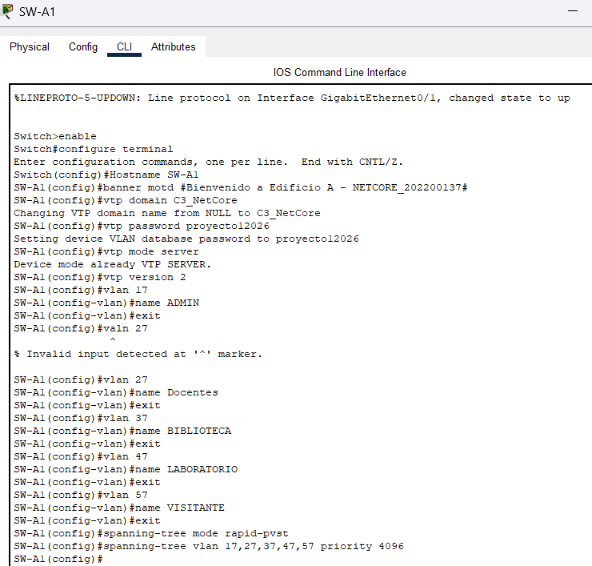

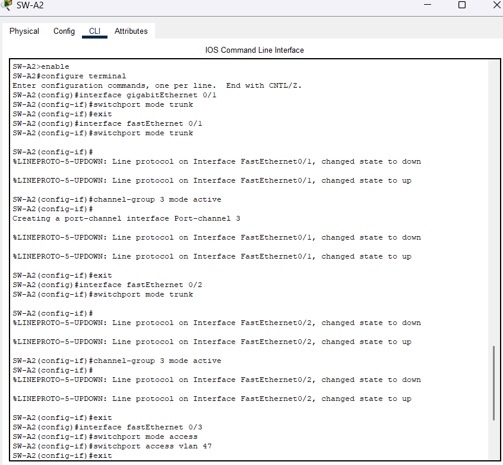

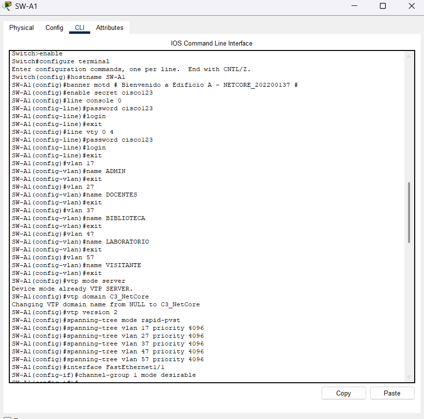

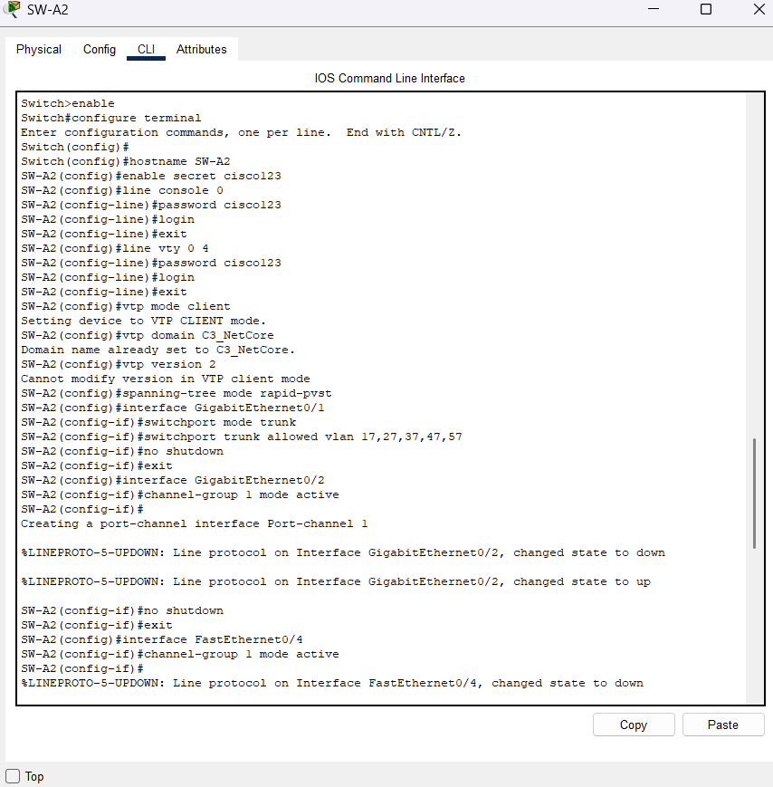

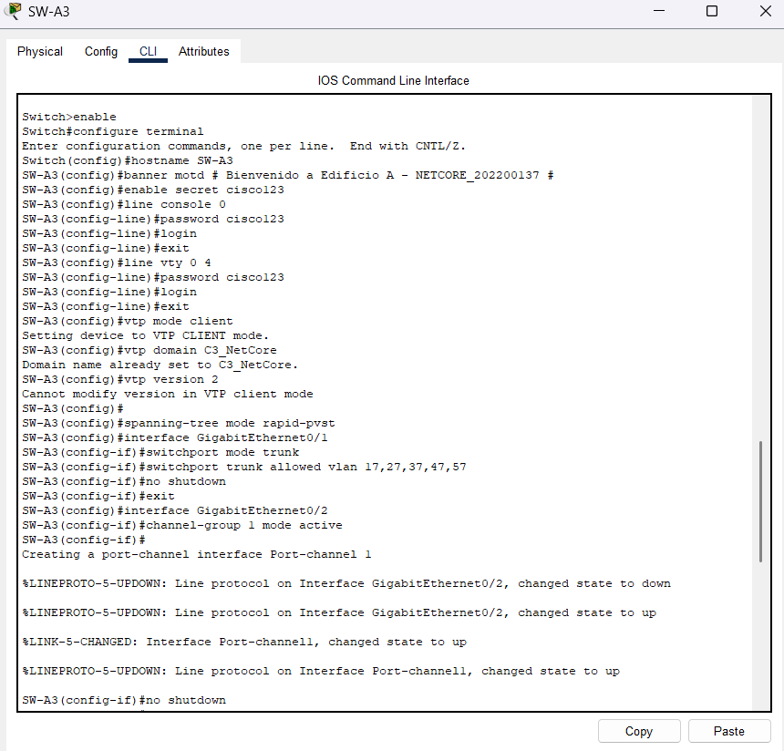

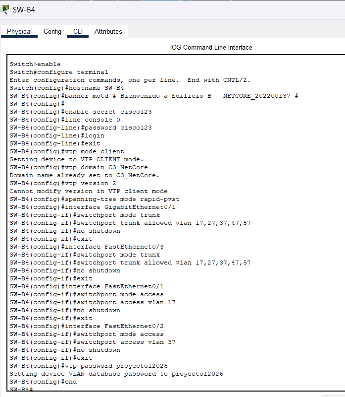

## 9. Pruebas de Ping

> Ejecutar desde: clic en PC -> Desktop -> Command Prompt
> Nota: En Packet Tracer el primer ping puede perder 1-2 paquetes por ARP. Repetir el ping para obtener 4/4 respuestas.

### VLAN 17 — ADMIN

| # | Origen | IP Origen | Destino | IP Destino | Resultado | Razón |
|---|--------|-----------|---------|------------|-----------|-------|
| 1 | Admin2 (Edif. A) | 192.168.17.2 | Admin1 (Edif. B) | 192.168.17.3 | EXITOSO | Misma VLAN 17 entre edificios |
| 2 | Admin2 (Edif. A) | 192.168.17.2 | Docencia8 (Edif. C) | 192.168.27.7 | FALLIDO | VLAN 17 distinta a VLAN 27 |


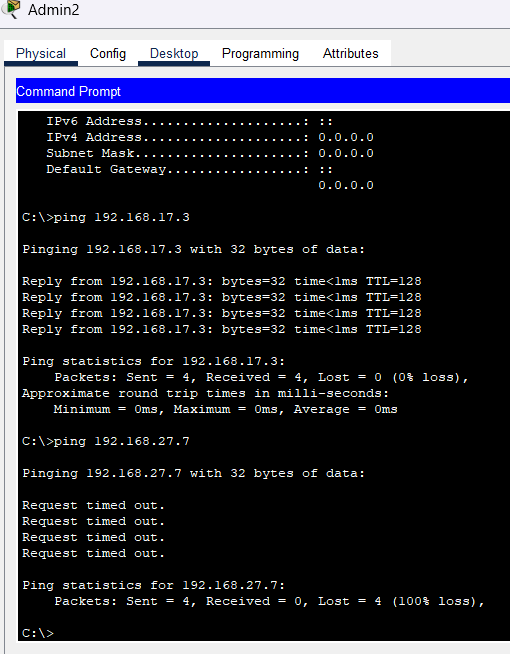

### VLAN 27 — DOCENTES

| # | Origen | IP Origen | Destino | IP Destino | Resultado | Razón |
|---|--------|-----------|---------|------------|-----------|-------|
| 3 | Docencia8 (Edif. C) | 192.168.27.7 | Docencia9 (Edif. C) | 192.168.27.8 | EXITOSO | Misma VLAN 27 mismo edificio |
| 4 | Docencia8 (Edif. C) | 192.168.27.7 | Admin3 (Edif. C) | 192.168.17.4 | FALLIDO | VLAN 27 distinta a VLAN 17 |

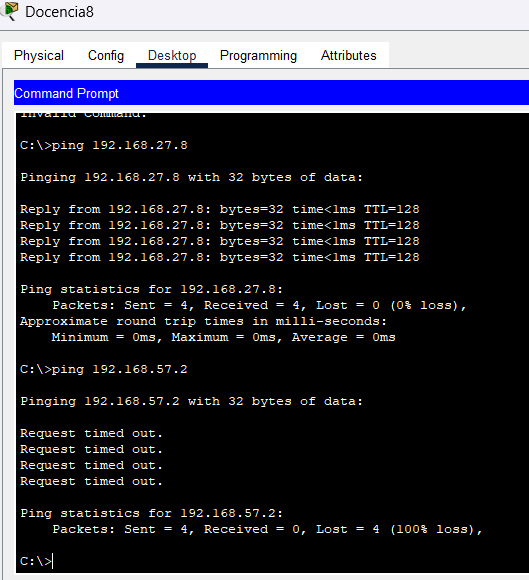

### VLAN 37 — BIBLIOTECA

| # | Origen | IP Origen | Destino | IP Destino | Resultado | Razón |
|---|--------|-----------|---------|------------|-----------|-------|
| 5 | Biblioteca1 (Edif. B) | 192.168.37.2 | Biblioteca6 (Edif. C) | 192.168.37.7 | EXITOSO | Misma VLAN 37 entre edificios |
| 6 | Biblioteca1 (Edif. B) | 192.168.37.2 | Visitantes1 (Edif. D) | 192.168.57.2 | FALLIDO | VLAN 37 distinta a VLAN 57 |

 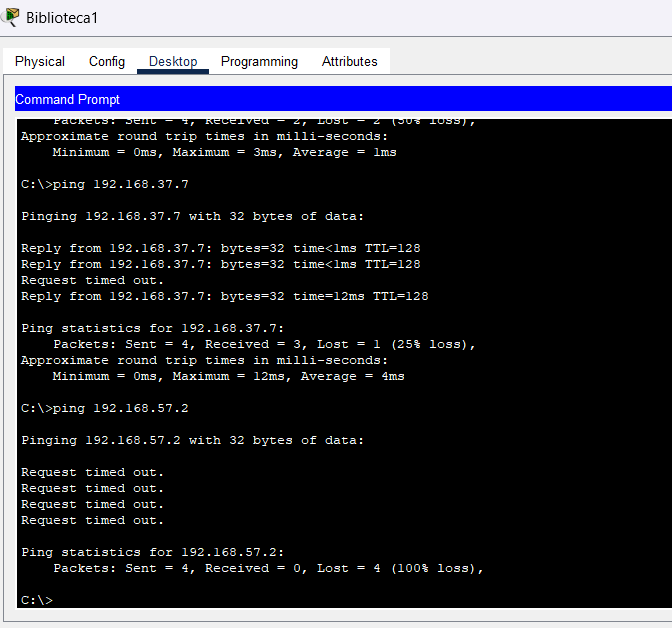

### VLAN 47 — LABORATORIO

| # | Origen | IP Origen | Destino | IP Destino | Resultado | Razón |
|---|--------|-----------|---------|------------|-----------|-------|
| 7 | Laboratorio2 (Edif. A) | 192.168.47.3 | Laboratorio3 (Edif. D) | 192.168.47.4 | EXITOSO | Misma VLAN 47 entre edificios |
| 8 | Laboratorio2 (Edif. A) | 192.168.47.3 | Biblioteca7 (Edif. D) | 192.168.37.8 | FALLIDO | VLAN 47 distinta a VLAN 37 |

* 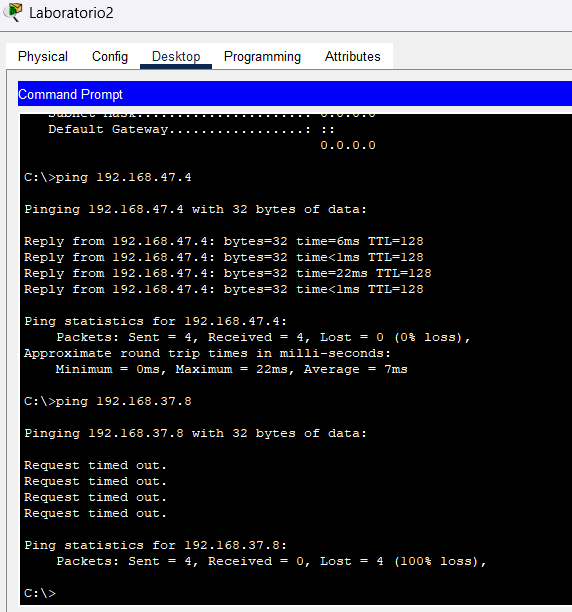

### VLAN 57 — VISITANTE

| # | Origen | IP Origen | Destino | IP Destino | Resultado | Razón |
|---|--------|-----------|---------|------------|-----------|-------|
| 9 | Visitantes1 (Edif. D) | 192.168.57.2 | Visitantes2 (Edif. D) | 192.168.57.3 | EXITOSO | Misma VLAN 57 |
| 10 | Visitantes1 (Edif. D) | 192.168.57.2 | Admin4 (Edif. D) | 192.168.17.5 | FALLIDO | VLAN 57 distinta a VLAN 17 |

* 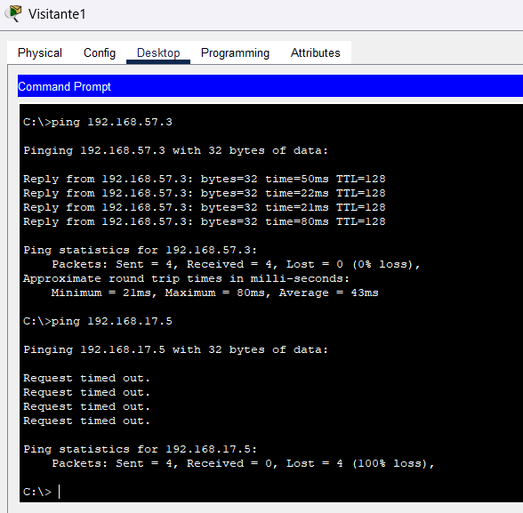

---

## 10. Evidencias Show Commands

> IMPORTANTE: Reemplazar con capturas reales de tu Packet Tracer.

### show vtp status — SW-A1 (Server)
* 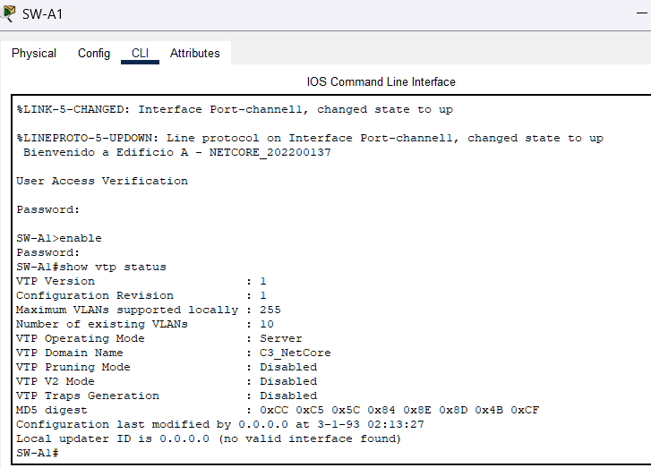

### show vtp status — SW-E1 (Transparente)
* 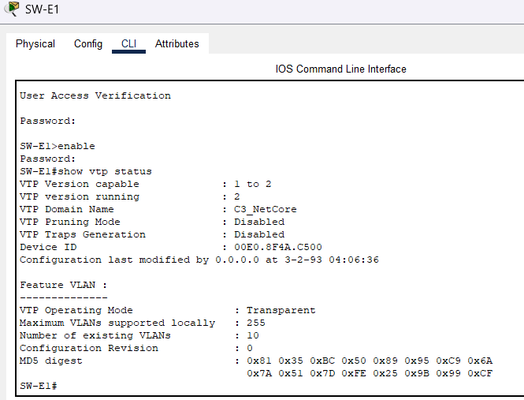

### show vlan brief — SW-A1
* 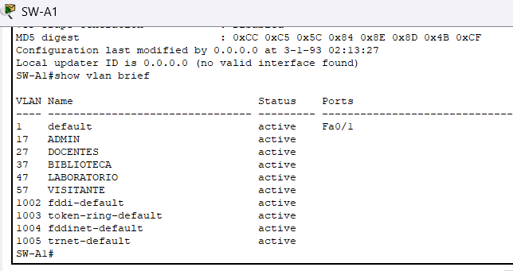

### show spanning-tree vlan 17 — SW-A1
* 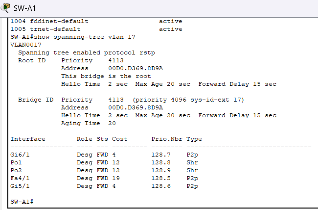

### show etherchannel summary — SW-A1
* 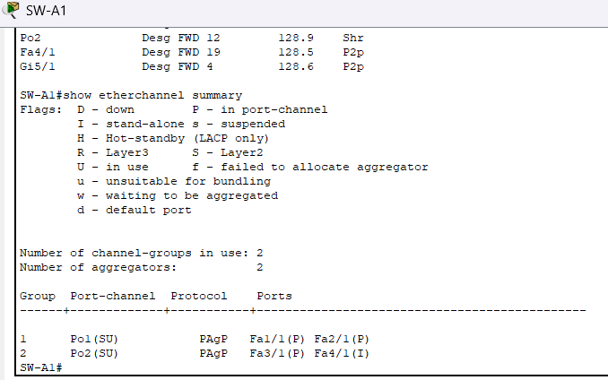

### show interfaces trunk — SW-A1
* 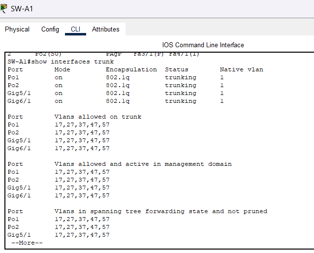

## 11. Presupuesto Estimado

> Precios de referencia en el mercado guatemalteco en Quetzales (Q).
> Tipo de cambio referencial: Q7.75 por USD.

### Equipo de Red

| # | Descripción | Cant. | Precio Unit. (Q) | Total (Q) |
|---|-------------|-------|-----------------|-----------|
| 1 | Switch Cisco Catalyst 2960-24TT | 10 | Q2,712.50 | Q27,125.00 |
| 2 | Switch Cisco equivalente Switch-PT | 6 | Q3,100.00 | Q18,600.00 |
| 3 | Módulo fibra óptica PT-SWITCH-NM-1FFE | 20 | Q348.75 | Q6,975.00 |
| 4 | Módulo GigabitEthernet PT-SWITCH-NM-1CGE | 12 | Q310.00 | Q3,720.00 |
| 5 | Cable UTP Cat5e (por metro) | 200 m | Q3.88 | Q775.00 |
| 6 | Cable UTP Cat6 (por metro) | 300 m | Q6.20 | Q1,860.00 |
| 7 | Cable Fibra Óptica OM3 multimodo (por metro) | 150 m | Q27.13 | Q4,068.75 |
| 8 | Conectores RJ-45 Cat5e (bolsa 100 uds) | 1 | Q116.25 | Q116.25 |
| 9 | Conectores RJ-45 Cat6 (bolsa 100 uds) | 1 | Q155.00 | Q155.00 |
| 10 | Conectores SC/LC para fibra OM3 (par) | 20 | Q62.00 | Q1,240.00 |
| 11 | Hub-PT equivalente (segmento legacy) | 2 | Q232.50 | Q465.00 |
| 12 | Repeater-PT equivalente | 1 | Q193.75 | Q193.75 |
| 13 | Access Point Cisco (equivalente AP-PT) | 2 | Q930.00 | Q1,860.00 |
| 14 | Rack de pared 12U para IDFs | 4 | Q658.75 | Q2,635.00 |
| 15 | Patch panel Cat6 24 puertos | 4 | Q426.25 | Q1,705.00 |
| 16 | Cable de consola USB-RJ45 | 2 | Q116.25 | Q232.50 |
| 17 | UPS 650VA para switches críticos | 2 | Q736.25 | Q1,472.50 |

### Mano de Obra

| # | Descripción | Cant. | Precio Unit. (Q) | Total (Q) |
|---|-------------|-------|-----------------|-----------|
| 18 | Técnico en redes (instalación y cableado) | 16 hrs | Q193.75 | Q3,100.00 |
| 19 | Configuración de switches y pruebas | 8 hrs | Q193.75 | Q1,550.00 |
| 20 | Documentación técnica | 4 hrs | Q155.00 | Q620.00 |

### Resumen de Costos

| Categoría | Subtotal (Q) |
|-----------|-------------|
| Switches y módulos | Q56,420.00 |
| Cables y conectores | Q8,214.75 |
| Accesorios y racks | Q6,763.75 |
| Mano de obra | Q5,270.00 |
| **TOTAL ESTIMADO** | **Q76,668.50** |
| IVA (12%) | Q9,200.22 |
| **TOTAL CON IVA** | **Q85,868.72** |

> Precios consultados en proveedores guatemaltecos: Ingram Micro GT, Computrónica y distribuidores Cisco locales. Precios pueden variar según disponibilidad del mercado.

---

